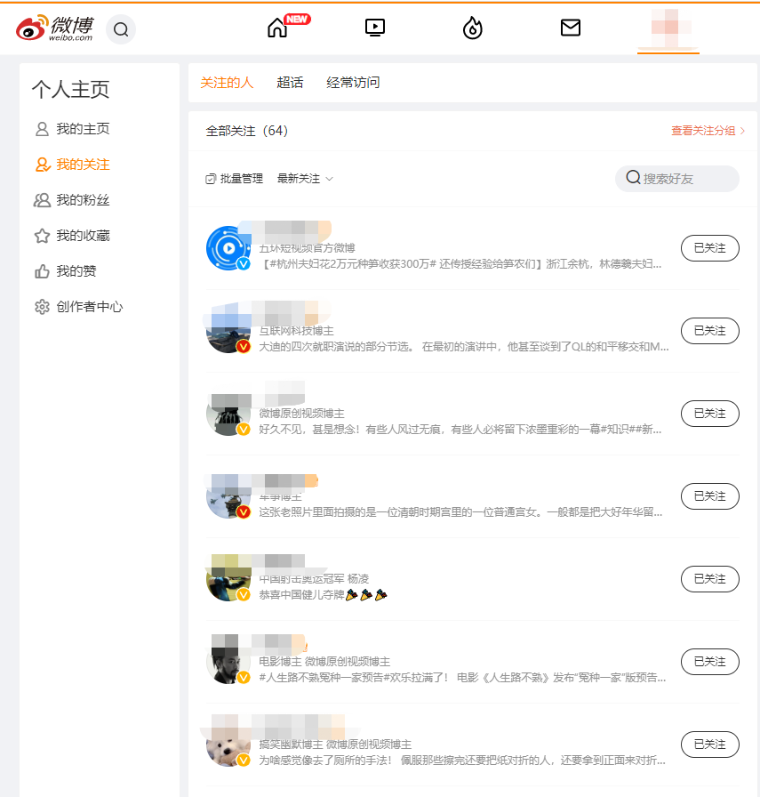
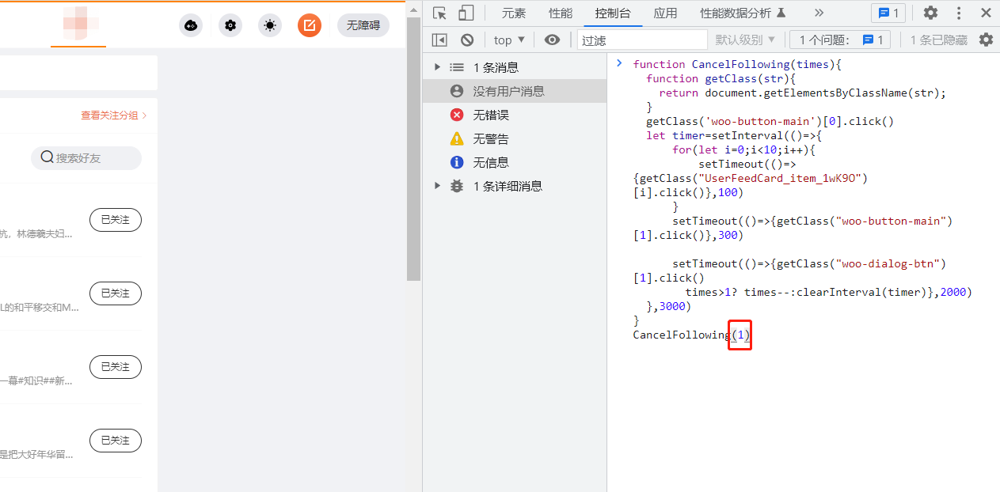

## 辅助脚本

### 自动批量取消关注

> 原因：长时间不登陆的帐号常被恶意买粉，导致关注列表中出现大批“垃圾帐号”
>
> 问题：微博网页版可以批量取消关注，但是需要手动选择每个要取关的帐号。
>
> 解决：用js脚本模拟点击，节省人力操作时间

#### 实现

注解版：

```js
//默认单次选择10个账户，需要指定循环次数
function CancelFollowing(times){
  function getClass(str){
    //返回一个数组
    return document.getElementsByClassName(str);
  }
  //【1】点击网页中‘批量管理’操作按钮
  getClass('woo-button-main')[0].click()
  let timer=setInterval(()=>{
          //【2】点击勾选指定的列表内容
      //每隔0.1s执行1次 ‘一次性定时器’限制执行次数（指定了列表勾选的内容个数
      for(let i=0;i<10;i++){
        //‘一次性定时器’=每过0.1s模拟点击一次
          setTimeout(()=>{getClass("UserFeedCard_item_1wK9O")[i].click()},100)    
      }
      //【3】模拟点击 ‘取消关注’操作按钮
      setTimeout(()=>{getClass("woo-button-main")[1].click()},300)
      //【4】点击确认取消关注
      setTimeout(()=>{
      getClass("woo-dialog-btn")[1].click()
        times>1? times--:clearInterval(timer)
        console.log(times,"执行次数")
        },2000)
  },3000)
}
CancelFollowing(1)
```

非注解版：

```js
function CancelFollowing(times){
  function getClass(str){
    return document.getElementsByClassName(str);
  }
  getClass('woo-button-main')[0].click()
  let timer=setInterval(()=>{
      for(let i=0;i<10;i++){
          setTimeout(()=>{getClass("UserFeedCard_item_1wK9O")[i].click()},100)    
      }
      setTimeout(()=>{getClass("woo-button-main")[1].click()},300)
      
      setTimeout(()=>{getClass("woo-dialog-btn")[1].click()
        times>1? times--:clearInterval(timer)},2000)
  },3000)
}
CancelFollowing(1)
```

#### 使用

1. 定位到关注列表

   

2. 打开浏览器控制台

   具体操作：鼠标右键-选择-控制台

   

3. 将代码（无注释版复制到控制台下方，修改循环次数）

   > 代码默认每次取消关注10个用户，如果自己需要取消300个用户，就将指定的循环次数改为10【即：CancelFollowing(10)】

   复制完代码块并修改好循环次数后，按enter键回车就ok。

#### 常见问题

**01 如果执行完一次代码还要继续删除怎么办？**

刷新当前页面，重复刚刚的步骤就好（重新复制代码到控制台运行）

**02 如果要取消所有帐号关注（现帐号关注有293个），写的循环次数为30，控制台显示报错？**

是因为默认每次循环要选择10个账户取消关注，运行到最后一个循环的时候现有关注列表只有3个帐号，所有会显示获取dom节点失败，只要帐号全部取消关注直接刷新页面就好


